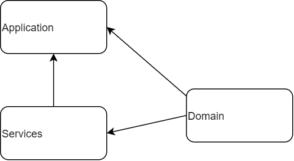

##Buyer Registration

Buyer registrations job is to provide an API which enables the user to update a users bidding status on an auction.

##MVP

The MVP provides one endpoint, allowing you to update a buyers status on an auction which will be stored in a CosmosDB collection.



##Developer Notes

**Solution Structure**

The solution has a simple structure with only three projects contained inside it.

**API**: Contains the endpoints, config and startup for the project. It references the other two projects.

**Domain**: Contains the internal representations of the business objects and logic. It is referenced from the other two projects.

**Infrastructure**: Contains the code which calls external infrastructure – currently this consists entirely of CosmosDB. It references the domain project.

**Cosmos Database**

The buyerRegistration database uses a CosmosDB with eventual consistency to store buyer status data.

The partition key is:

buyerRequest.CustomerId-buyerRequest.MarketIdentityCode.

The ID is:

buyerRequest.AuctionId-buyerRequest.CustomerId-buyerRequest.MarketIdentityCode.

An example document from the container can be seen below:
```json
{
    "id": "123-4-201",
    "partitionKey": "4-201",
    "marketIdentityCode": 201,
    "tenderId": 123,
    "tenderHouseId": 1001,
    "customerId": "4",
    "buyerId": "5",
    "buyerRef": "10C",
    "status": "Pending",
    "cta": "The Coffe was hot",
    "_rid": "VLE9AIJtmQYCAAAAAAAAAA==",
    "_self": "dbs/VLE9AA==/colls/VLE9AIJtmQY=/docs/VLE9AIJtmQYCAAAAAAAAAA==/",
    "_etag": "\"00000000-0000-0000-554c-2b6ffc0901d8\"",
    "_attachments": "attachments/",
    "_ts": 1650523864
}
```
**Restoring Data**

CosmosDB data can be restored using the point and time restore process:
https://docs.microsoft.com/en-us/azure/cosmos-db/restore-account-continuous-backup

**External Dependencies**

The buyer registration service is dependent on the CosmosDB in order to function.


##Platform Integration Notes

**Client Timeouts**

The recommended timeout for the buyer Registration endpoints is 2 seconds.

##For Test locally 

Install cosmos-db emulator from here https://docs.microsoft.com/en-us/azure/cosmos-db/local-emulator?tabs=ssl-netstd21

then create database and put buyer-registration in Database id textbox

Then create new container and put buyerdata in Containerid and partitionKey in partitionKey.

now you can run api on your local iis and test complete flow.

An sample json payload for test api can be seen below:
```json
{
    "MarketIdentityCode": 201,
    "TenderId": 123,
    "TenderHouseId": 1001,
    "CustomerId": "4",
    "BuyerId": "5",
    "Status": "Pending",
    "BuyerRef": "10C",
    "Action": "The Coffe was hot"
}
```


